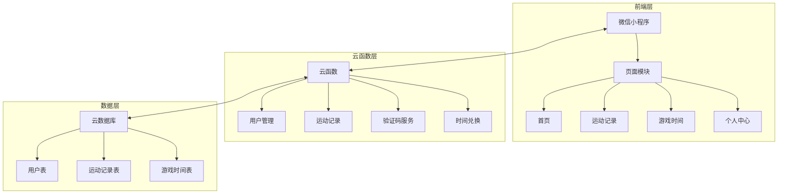
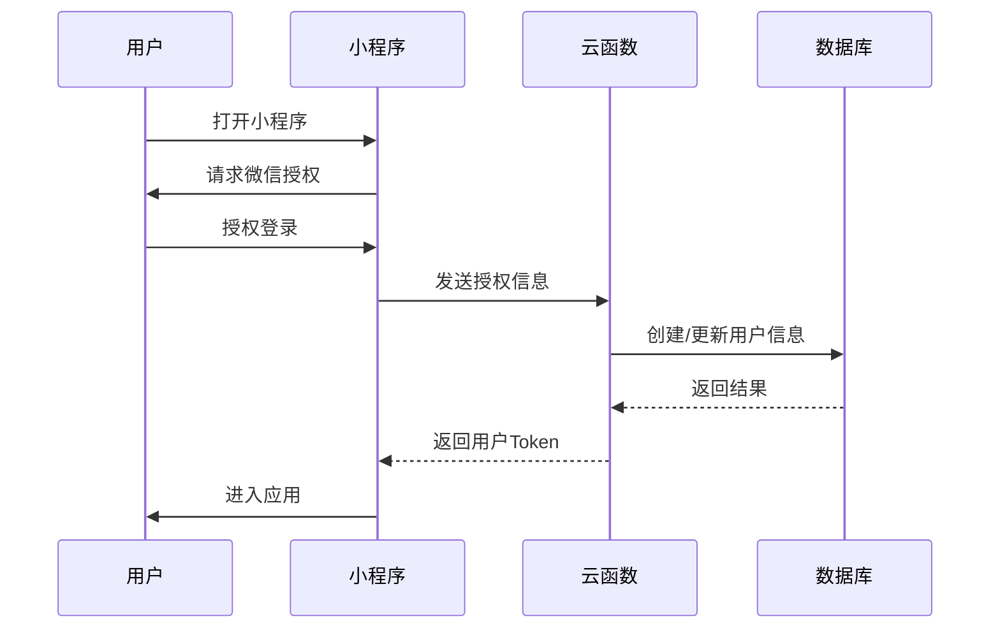
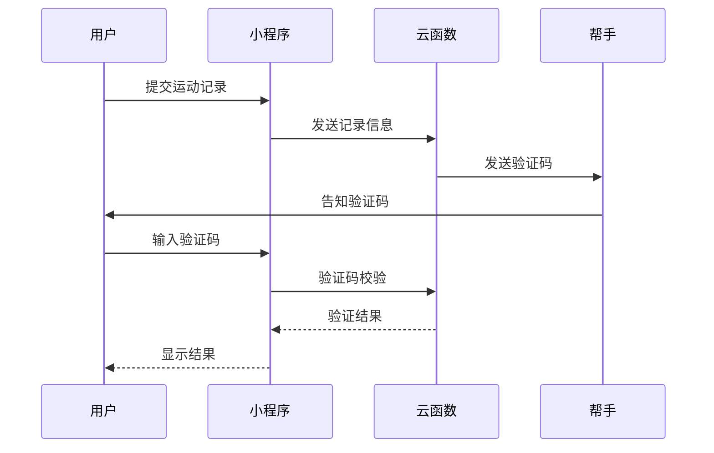
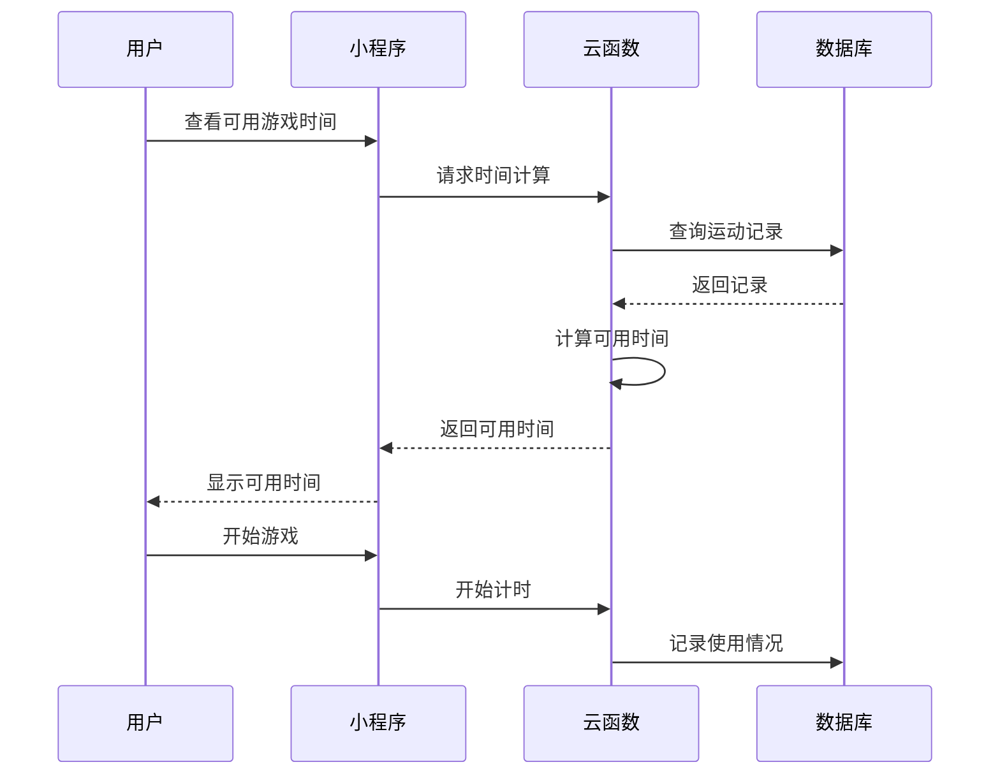
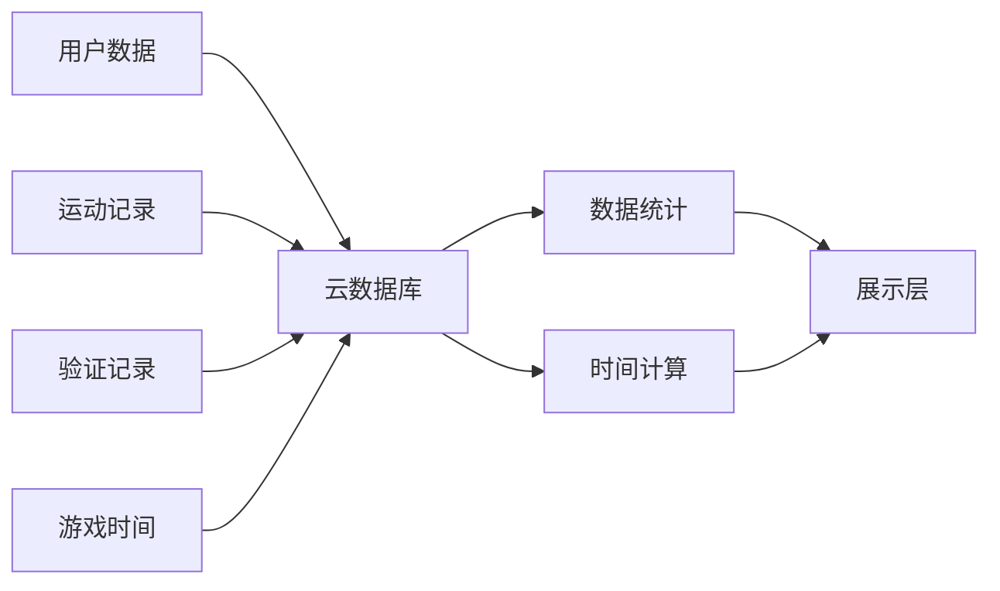
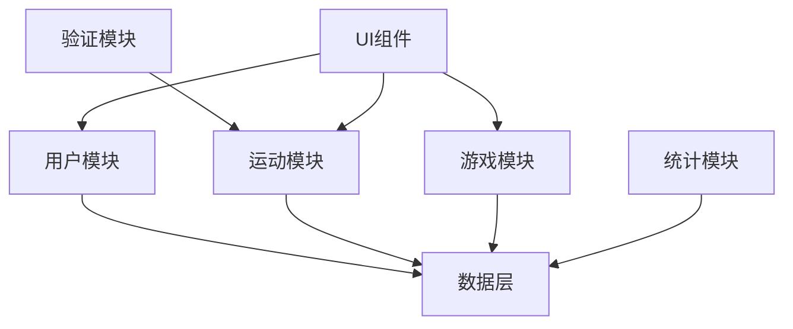

# 流程图文档

## 系统架构图

```mermaid
graph TB
    subgraph 前端层
        A[微信小程序] --> B[页面模块]
        B --> B1[首页]
        B --> B2[运动记录]
        B --> B3[游戏时间]
        B --> B4[个人中心]
    end

    subgraph 云函数层
        C[云函数] --> C1[用户管理]
        C --> C2[运动记录]
        C --> C3[验证码服务]
        C --> C4[时间兑换]
    end

    subgraph 数据层
        D[云数据库] --> D1[用户表]
        D --> D2[运动记录表]
        D --> D3[游戏时间表]
    end

    A <--> C
    C <--> D
```

## 用户注册流程

```mermaid
sequenceDiagram
    participant U as 用户
    participant A as 小程序
    participant C as 云函数
    participant D as 数据库

    U->>A: 打开小程序
    A->>U: 请求微信授权
    U->>A: 授权登录
    A->>C: 发送授权信息
    C->>D: 创建/更新用户信息
    D-->>C: 返回结果
    C-->>A: 返回用户Token
    A->>U: 进入应用
```

## 运动记录验证流程

```mermaid
sequenceDiagram
    participant U as 用户
    participant A as 小程序
    participant C as 云函数
    participant H as 帮手

    U->>A: 提交运动记录
    A->>C: 发送记录信息
    C->>H: 发送验证码
    H->>U: 告知验证码
    U->>A: 输入验证码
    A->>C: 验证码校验
    C-->>A: 验证结果
    A-->>U: 显示结果
```

## 游戏时间兑换流程

```mermaid
sequenceDiagram
    participant U as 用户
    participant A as 小程序
    participant C as 云函数
    participant D as 数据库

    U->>A: 查看可用游戏时间
    A->>C: 请求时间计算
    C->>D: 查询运动记录
    D-->>C: 返回记录
    C->>C: 计算可用时间
    C-->>A: 返回可用时间
    A-->>U: 显示可用时间
    U->>A: 开始游戏
    A->>C: 开始计时
    C->>D: 记录使用情况
```

## 数据流转图

```mermaid
graph LR
    A[用户数据] --> B[云数据库]
    C[运动记录] --> B
    D[验证记录] --> B
    E[游戏时间] --> B
    B --> F[数据统计]
    B --> G[时间计算]
    F --> H[展示层]
    G --> H
```

## 模块依赖图

```mermaid
graph TB
    A[用户模块] --> D[数据层]
    B[运动模块] --> D
    C[游戏模块] --> D
    E[验证模块] --> B
    F[统计模块] --> D
    G[UI组件] --> A
    G --> B
    G --> C
```